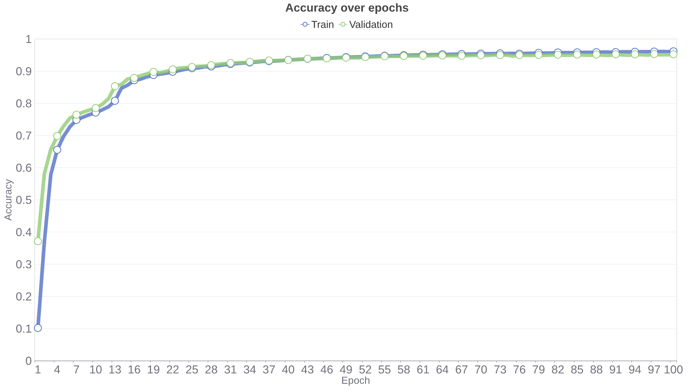
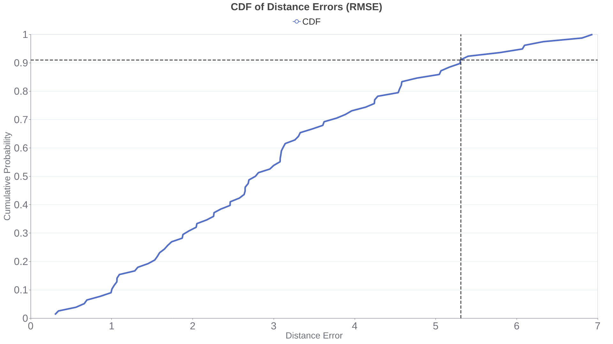

# DNN From Scratch

This repository implements a deep neural network (DNN) from scratch in Rust, focusing on two key experiments: image classification with the MNIST dataset and signal strength-based predictions using an RSSI dataset. The project demonstrates building and training a neural network without relying on external machine learning libraries.

---

## 🚀 Features

- **Custom Neural Network Implementation:** Build and train DNNs using only Rust libraries and custom modules.
- **Examples for Two Experiments:**
  - **MNIST Dataset:** Handwritten digit classification.
  - **RSSI Dataset:** Analysis and predictions based on signal strength data.
- **Modular Codebase:** Cleanly separated concerns such as activation functions, loss computation, and neural network architecture.
- **Visualization:** Generate reports and plots to visualize experiment results.

---

## 📂 Directory Structure

```
dnn-from-scratch/
├── README.md                # Project overview and instructions
├── Cargo.toml               # Project dependencies and configuration
├── LICENSE                  # License information
├── assets/                  # Datasets and auxiliary data
│   ├── mnist/
│   │   ├── x_test.npy       # MNIST test images
│   │   ├── x_train.npy      # MNIST training images
│   │   ├── y_test.npy       # MNIST test labels
│   │   └── y_train.npy      # MNIST training labels
│   └── rssi/
│       └── rssi-dataset.csv # RSSI dataset
├── dnn_from_scratch/        # Core library for the neural network
│   ├── Cargo.toml           # Library-specific dependencies
│   └── src/
│       ├── activation.rs    # Activation functions
│       ├── fully_connected.rs # Fully connected layer module
│       ├── lib.rs           # Entry point for the library
│       ├── loss.rs          # Loss functions
│       ├── neural_network.rs # Neural network definition
│       ├── optimizer.rs     # Optimizer implementations (e.g., Adam)
│       ├── report.rs        # Reporting and result output
│       ├── utils.rs         # Utility functions for regression/classification
│       └── weights_initializer.rs # Weight initialization strategies
└── src/                     # Main application for experiments
    ├── main.rs              # Entry point for the executable
    ├── mnist_experiment/    # MNIST Experiment-related modules
    │   ├── dataset_setup.rs # MNIST dataset preprocessing
    │   ├── mod.rs           # MNIST Experiment module entry point
    │   └── plot.rs          # Plotting results for MNIST Experiment
    └── rssi_experiment/     # RSSI Experiment-related modules
        ├── dataset_setup.rs # RSSI dataset preprocessing
        ├── mod.rs           # RSSI Experiment module entry point
        └── plot.rs          # Plotting results for RSSI Experiment
```

---

## 🛠️ Getting Started

### Prerequisites

- **Rust:** Install the latest version from [rust-lang.org](https://www.rust-lang.org/).

### Cloning the Repository

Clone the repository and navigate to the project folder:
```bash
git clone https://github.com/akaTsunemori/dnn-from-scratch.git
cd dnn-from-scratch
```

### Building the Project

To build the project, run:

```bash
cargo build --release
```

### Running Experiments
To run the experiments, run:

```bash
cargo run --release
```


---

## 📚 Documentation

Complete API documentation for this project is available at [https://akatsunemori.github.io/dnn-from-scratch/](https://akatsunemori.github.io/dnn-from-scratch/).

The documentation includes:
- Detailed API references for all modules
- Implementation details of neural network components
- Technical explanations

You can also generate the documentation locally by running:

```bash
cargo doc --release --workspace --no-deps --target-dir=docs
```

---

## 🧪 Datasets

1. **MNIST Dataset:**
   - Stored in `assets/mnist/`.
   - Preprocessed as `.npy` files for seamless integration.

2. **RSSI Dataset:**
   - Found in `assets/rssi/rssi-dataset.csv`.
   - Contains signal strength data and coordinates (X, Y) for analysis.

---

## 📈 Results & Reporting

Each experiment generates reports and plots showcasing:
- Training history.
- Model performance metrics (e.g., accuracy for MNIST, CDF of RMSE for RSSI).

Plots and reports are saved in the `output/` folder. You can check a preview of the expected results below by clicking to reveal the contents.

<details>
    <summary><b>MNIST Experiment</b></summary>
<br>

Preview of training history:

```
Epoch 1/100 | Train: Loss 2.06653167, Accuracy 0.10133333 | Test: Loss 1.95600680, Accuracy 0.37100000
(...)
Epoch 100/100 | Train: Loss 0.13694486, Accuracy 0.96098333 | Test: Loss 0.15178871, Accuracy 0.95190000
```

Output plot:



</details>

<details>
    <summary><b>RSSI Experiment</b></summary>
<br>

Preview of training history:

```
Epoch 1/2500 | Train: Loss 18046.39994821, Error 134.33688975 | Test: Loss 21310.27160128, Error 145.98038088
(...)
Epoch 2500/2500 | Train: Loss 5.56953465, Error 2.35998615 | Test: Loss 5.85785166, Error 2.42029991
```

Output plot:



</details>

---

## 📜 License

This project is licensed under the [MIT License](./LICENSE).

---

## 🤝 Contributing

Contributions are welcome! Feel free to fork the repository and submit a pull request.

1. Fork the repo.
2. Create a new branch (`git checkout -b feature-name`).
3. Commit your changes (`git commit -m "Add feature"`).
4. Push to the branch (`git push origin feature-name`).
5. Open a pull request.

---

## 📧 Contact

For any inquiries or support, please create an issue.

---

Enjoy building your neural networks from scratch! 🎉
